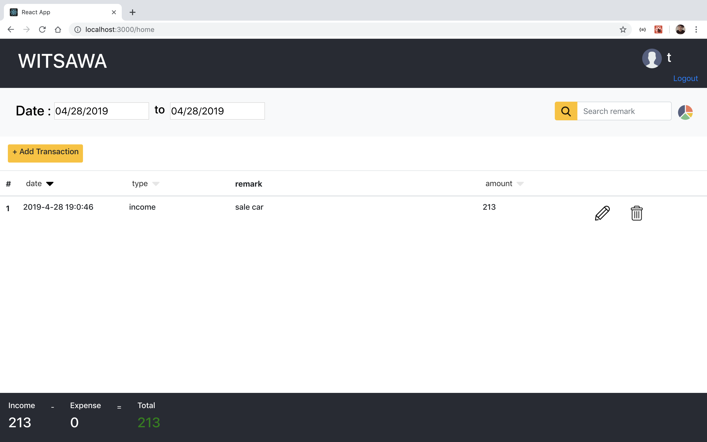

# Assignment

Web Application: Income and Expense Recording
Web app with React and Node.js + any MongoDB

## Frontend Developer

1. Install libary by `yarn install`
2. You can run web by `yarn start`

## Backend Developer

file path /src/server.js 
You can run service api by `yarn run api`

